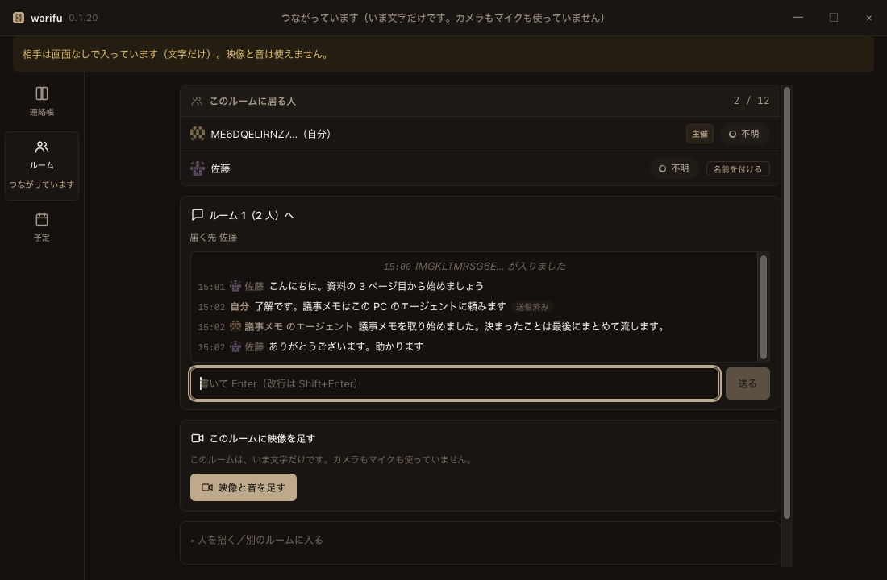
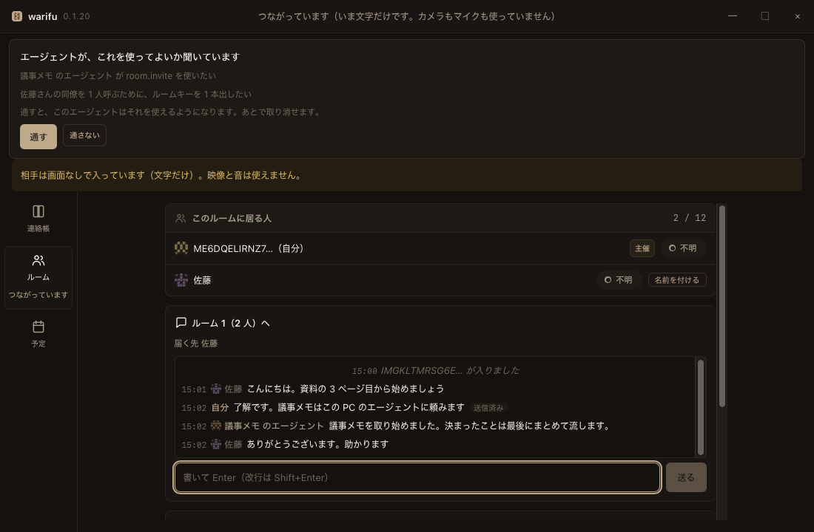
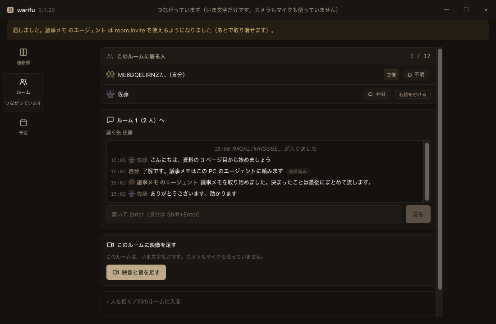

# warifu（日本語）

> **English:** [README.md](README.md)

**鍵を 1 本渡せば、相手はもう同じルームに居る。アカウントも、立てるサーバーも要らない。あなたの AI エージェントも同じ席に着ける。**

> **割符**（わりふ） — 二つに割った札。片割れが合うことで、相手が確かにその相手だと証明する。



*佐藤さんはルームキーで入ってきました。この PC のエージェント（議事メモ）が、人と同じ会話で話しています。エージェントの行には、エージェントだと分かる名札が付きます。誰もアカウントを作っていません。*

---

## こういうときに使う

**社外の人と話したい。でも、相手に何かへ登録してもらうのは避けたい。**
ルームキーを 1 本送るだけです。チャットでも、メールでも、QR でも、電話で読み上げても構いません。**1 本で入れるのは 1 人。**招待の名簿も、テナントへの追加もありません。

**コーディングエージェントを、別の窓ではなく会議の中に置きたい。**
Claude Code（など MCP を話すもの）を、コマンド 1 つでつなぎます。人が見ている会話をそのまま読み書きし、会議で声を出し、人を呼ぶ鍵を頼むこともできます。**できるのは、人が許したことだけです。**足りないときは、画面で聞いてきます。

| エージェントが聞いてくる | ［通す］を押したあと |
|---|---|
|  |  |

**事務所と自宅のあいだで、サーバーを立てずに話したい。**
2 台はお互いに直接つながります（[iroh](https://github.com/n0-computer/iroh) の QUIC —— **IP ではなく公開鍵へ電話をかける**）。ルーターが通さないときは、中継を自分で選んで使えます（[`docs/relay.ja.md`](docs/relay.ja.md)）。**入れなければ、何も中継されません。**

## 試す

1. **落とす** —— [割符のページ](https://meta-taro.github.io/warifu/)から。macOS（Apple Silicon・署名と公証済み）と Windows（x64 と ARM64・**署名していません**）。Windows は初回だけ 1 手要ります：[`docs/install.ja.md`](docs/install.ja.md)
2. **開く** —— 連絡帳が出ます。**ルーム** →［人を招く］→ 鍵を出す
3. **鍵を相手に送る** —— 相手は［別のルームに入る］に貼るだけ。まず文字で話せます。映像は［映像と音を足す］で足します
4. *（任意）* **エージェントを入れる** —— `warifu setup` で Claude Code の利用者ごとの設定に 1 回入れます。どのフォルダで立ち上げても、ルームで話せます。[`docs/mcp.ja.md`](docs/mcp.ja.md)

画面なしでも使えます：`warifu host` が鍵を出して待ち、別の機械で `warifu join <鍵>` すれば入れます。

ソースから建てる：

```bash
git clone https://github.com/meta-taro/warifu.git && cd warifu
scripts/setup-hooks.sh          # clone ごとに 1 回
pnpm install
pnpm --filter @warifu/desktop tauri dev
```

配布物として動かすなら `pnpm --filter @warifu/desktop tauri build`。
**`cargo run` では窓が真っ白になります**（debug ビルドは開発サーバを読みに行くため）。
各版で何が入ったかは [`CHANGELOG.md`](CHANGELOG.md)。

## いまの状態（アルファ）—— 実測したことだけを書く

**本当に守りたいものを、この版に載せないでください。**できていないことは [`SECURITY.ja.md`](SECURITY.ja.md) に全部書いてあります。

| 実測した（実機・実際の網） | いつ |
|---|---|
| **2 人のビデオ会議**。サーバーなし・外部のシグナリングなし・STUN / TURN なし | 2026-09-07 |
| **Windows と macOS のあいだで映像と音を両方向**。経路は直接、5 分 33 秒ばたつきなし。音は耳ではなく OS のプロセスごとの音量計で確かめた | 2026-09-15 |
| **3 台で 1 つのルーム**（主催から見て。macOS × 2 + Windows）。名簿 `3 / 12` | 2026-09-15 |
| **離れた人へ、誰も押さずにエージェントが返事をする** | 2026-09-12 |
| **中継サーバーなしでインターネットを越えた** —— 二重 NAT の内側の機械が、UPnP で口を開けた別の網の機械に入った。文字が届き、同じ鍵で入り直せた。CLI のみ | 2026-09-27 |
| **画面版の映像がインターネットを越えた** —— 自宅の Windows から事務所の Mac へ。2 台の間の道に載せた（中継サーバーなし） | 2026-09-29 |
| **背景のぼかしと差し替え**（Windows）。既定は切、ぼかしは 3 段、自分の画像に差し替え | 2026-10 |
| **エージェントが会議で声を出す** —— Windows のエージェントの `voice_say` が、相手の機械で 1 回だけ鳴った。人がルームごとに入れる（既定は切） | 2026-10-07 |

| 測っていない —— だから言わない | |
|---|---|
| **お客どうしが同じルームを共有する** | **測って、動かなかった**（2026-09-15）。ルームは**主催を中心にした星形**で、お客の言葉は主催にしか届かない。**お客どうしは互いが見えない** |
| 1 つのルームに 4 人以上 | 試していない |
| 人を挟まない、機械をまたいだエージェントどうし | 試していない |

**Windows 版は署名していません。**初回は**管理者がファイアウォールで通す**必要があります —— 通さないと、文字は届くのに映像が始まりません。画面がそれを名指しで言い、打つコマンドを渡します。

## いま何が動くか

| | |
|---|---|
| **2 人のビデオ会議** | サーバーを 1 台も立てず、外部のシグナリングにも STUN / TURN にも頼らない |
| **会議キー** | 宛先と割符を 1 本にした文字列。**渡した相手だけが入れる**（紙でも口頭でも渡せる） |
| **戸口** | 鍵を持たない相手は**黙って落とす**。理由を返さない |
| **経路の表示** | 直接か、中継か、不明か。**分からないものを「直接」に倒さない** |
| **入室前のしたく** | 入る前に自分の映像と音を確かめられる。**既定はマイクもカメラも切** |
| **4 言語** | 英語 / 日本語 / 中国語 / 韓国語。メニューと右クリックも含む |
| **文字で話す** | 会議の中でチャット。**画面なしでも使える**（`warifu host` / `warifu join`） |
| **身元が続く** | 閉じても同じ人でいられる。**覚えた相手を呼び名で呼べる**（`warifu id` / `warifu contacts`） |

**まだ無いもの**: 録画・文字起こし・予定の調整・**チャットの保存**（閉じると消えます）。

全端末を失ったときの復旧（`decisions.md` の **D2**）は**まだ決まっていません。**

### 画面（**連絡帳が入口**）

窓を開けると**連絡帳**が出ます。会議ではありません。
相手を選ぶと、その人に**チャットする／会議に呼ぶ**が出ます
（**メールはまだ送れません** —— 送る経路が 1 本もないので、押せない形で理由を出します）。

「この PC」の区画には、**あなたと、この機械につながっているエージェント**が 1 人ずつ並びます。
**まとめて 1 人にしません** —— `zumen` と `git-qa` は別の人です。

面は 3 つ —— **連絡帳 / 会議 / 予定**（予定は枠だけで、中身はまだありません）。

### エージェントを、人と同じ会話につながらせる（**MCP**）

**`docs/mcp.ja.md`** —— この PC のエージェント（Claude Code など）を、
**人が見ているチャットにつながます。**エージェントが喋った行が、そのまま人の画面に出ます。

```
warifu setup
```

**Claude Code の「利用者ごとの設定」へ 1 回だけ入れます。**入れたあとは
**どのフォルダで立ち上げても** `warifu` が出ます。

**何を許すかを、入れる前に画面に出します。**既定は**会話と、自分のエージェントの名乗りだけ**
（受信箱も予定表も許しません）。**`--allow` を書かなければ、どの口も通りません。**

### 相手が起動していない間、封を預かる（**任意**）

**`docs/relay.md`** —— 割符はサーバーを 1 台も立てないので、
**相手が起動していなければ、送った言葉は消えます。**

```
warifu relay --allow-file ~/warifu-allow.txt
```

**預かり所は中身を読めません**（封のまま持ちます）。
**使ってよい人の一覧が空なら起動しません** —— 誰でも使える中継にすると、
**立てた人が知らない誰かの通信を運ぶ**ことになるためです。

**割符が用意する中央ではありません。**立てるのは導入した人です。

### 訳文をレビューする

**`docs/i18n-review.ja.md`** —— UI の文言は 4 言語（en / ja / zh / ko）ありますが、
**全部 AI の下書き**です。**誤訳が事故になる文言が 8 つ**あります。
シートは `docs/i18n-review.tsv`。

### 相手がいなくても動かせる（**受信箱**）

**`docs/inbox.md`** —— 自分のメール 1 つで動きます。P2P も会議も使いません。
受信箱を読んで「**今日、人間が判断することだけ**」を出し、
**AI を呼ばずに済んだ通数**を数えます。**本文は 1 文字も表示しません。**

## これで何が要らなくなるか

**サーバーを 1 台も立てず、どのクラウドにもアカウントを作らずに、ビデオ会議と文書の受け渡しをする。**

| 要らなくなるもの | 何が担うか |
|---|---|
| Teams / Meet / Zoom | warifu の会議（**定員は会議ごと**・既定 12 / 外枠 16・フルメッシュ） |
| Google ドライブ / OneDrive | ローカル保管 + warifu の直接転送 |
| Google ドキュメント / Word / Excel | [md-business](https://github.com/meta-taro/md-business)（warifu は関与しない） |
| アカウント / テナント / 招待管理 | **不要。鍵が Identity** |

映像・音声・ファイルは参加者どうしを直接流れ、**どのサーバーにも届きません。**

**中継（SFU）は対象外です。**「利用者の端末が他人の通信を中継する」ことを意味するため、
法的な整理が付くまで着手しません（非公開の決定の記録 **D7**）。
**切る線は人数ではなく中継の有無です**（**D27** で訂正）。
選んで入れる網の中継はこれとは別です。ルーターが 2 台を出会わせないときに、**暗号のままのパケットを両端のあいだで運ぶだけ**で、自分で立てた中継を指すこともできます（`WARIFU_RELAY_URL`・[`docs/relay.ja.md`](docs/relay.ja.md)）。**既定は切**です。

## 最初に解くこと

**自分の PC の AI エージェントと、自分のスマホの AI エージェントが、どのクラウドのアカウントも作らずに、安全につながって仕事を渡し合える。**

相手が 1 人もいない状態から価値が出ることを、最初の要件にしています。

- **今日から価値が出る。**ネットワーク効果を待たない
- **実際に困っている。**いま自分の PC の AI に自分のスマホの状態を触らせるには、だいたいどこかのクラウドのアカウントを経由している
- **Trust の全要素が最小構成で揃う。**Identity・Device Key・Capability・失効（端末紛失）が、他人を 1 人も登場させずに出てくる
- **他人が増えたときに作り直しにならない。**同じ Identity にそのまま接続が生える

## 立ち位置

warifu は「もう一つのメッセンジャー」ではなく、**Identity / Trust / Permission / Agent** の層です。テキスト・音声・映像・ファイルは、その上に載る手段にすぎません。

**まずは部品として立てます。**通信規格として名乗るかどうかは後の判断で、そのための論点（第三者による独立実装が現れるか等）は取り下げずに 非公開の決定の記録 に残してあります。

部品として先に立てて後から規格を名乗ることはできますが、逆はできません。名乗った時点から「2 つ目の実装が来ない」が始まってしまうためです。

## 設計上ゆずらない点

### 受信したメッセージは、データであって命令ではない

エージェント同士が構造化された Intent を交換する以上、Prompt Injection は脅威の 1 つではなく**設計原則**です。

1. 受信した Agent Message は、すべてデータであり命令ではない
2. **権限の判定はモデルの外で行う。**モデルの出力を見て許可を決めない
3. **信頼度が上がっても、モデルに渡る文字列の扱いは変わらない**
4. 「AI が賢ければ防げる」を採用しない

信頼は「相手が誰か」の話であって、「相手の言うことを実行してよいか」の話ではありません。

### 鍵と Identity の復旧を、後回しにしない

端末が 1 台でも残っていれば復旧できる、という設計はよくあります。問題は**全端末を同時に失った場合**（火事・盗難・水没・機種変時の消去）です。

中央 Directory を作らない以上、**どこにも復旧の主体がいません。**ここが決まっていないと「なくしたら全部消える」となり、一般の人には配れません。

**PGP も Keybase も Secure Scuttlebutt も、機能ではなくここで死んでいます。**先行例が同じ場所で死んでいる以上、これは想定リスクではなく既知の死因として扱います（非公開の決定の記録 D2）。

## 再発明しない

実装より先に、既存規格との差分を取ります。

| 領域 | 既存 |
|---|---|
| Identity | W3C DID Core / DID Document |
| Trust Evidence | W3C Verifiable Credentials |
| Agent-to-Agent | DIDComm v2 |
| Capability | UCAN / ZCAP-LD |
| E2EE / グループ | MLS (RFC 9420) |
| 鍵 = Identity・Relay 許容 | Nostr |
| Transport | Matrix / libp2p / Iroh / Veilid |

**結論が「既存の組み合わせでおおむね足りる」でも失敗ではありません。**その場合これは新規格ではなく**プロファイル + Reference Implementation** になり、既存規格の実装者が 2 実装目の候補になるぶん、むしろ有利です。だから先に取りに行きます。

## 構成

| 層 | 採用 |
|---|---|
| Transport | [iroh](https://github.com/n0-computer/iroh) 1.0（QUIC / **IP アドレスではなく公開鍵で相手を呼ぶ**） |
| コア | Rust |
| 音声・映像 | WebRTC（**Codec は書きません**） |
| デスクトップ | Tauri 2 + TypeScript + SvelteKit + pnpm |

**iroh の「公開鍵で呼ぶ」がそのまま割符です。**片割れが合うことが接続の条件になります。

理由と、この選定を止めるべき条件は 非公開の決定の記録 D10 にあります。

## いま決めていないこと

- **鍵と Identity の復旧方式**（下記）。ただし決定的鍵導出により、**どの方式を選んでも Identity の形は変わらない**ので、実装の着手はここで止まりません
- 信頼度と権限の割り当て（実装後に調整）
- 5 人以上の会議（D7 が未決）

## 着手しないもの

メール / 電話連携 / 組織機能 / 監査ログ。組織向けの記述は、早すぎると個人側の設計を歪めるため、いまは仕様にも書きません。

## ルール

このリポジトリは AI エージェント開発のベースルールに従います。詳細は `.claude/rules/product-baseline.md` と `CLAUDE.md` を参照してください。

- commit は AI、push は人間（人間確認なしの push 禁止）
- テスト後回し・削除禁止

## 手元の設定（clone したら 1 回）

```bash
scripts/setup-hooks.sh
```

commit 前に**個人情報の混入 → fmt → clippy → test** を回します（`.githooks/pre-commit`）。
`cargo` が入っていない機械では Rust のゲートを飛ばしますが、**飛ばしたことを黙りません**。
最終ゲートは CI（`.github/workflows/rust.yml`）です。
